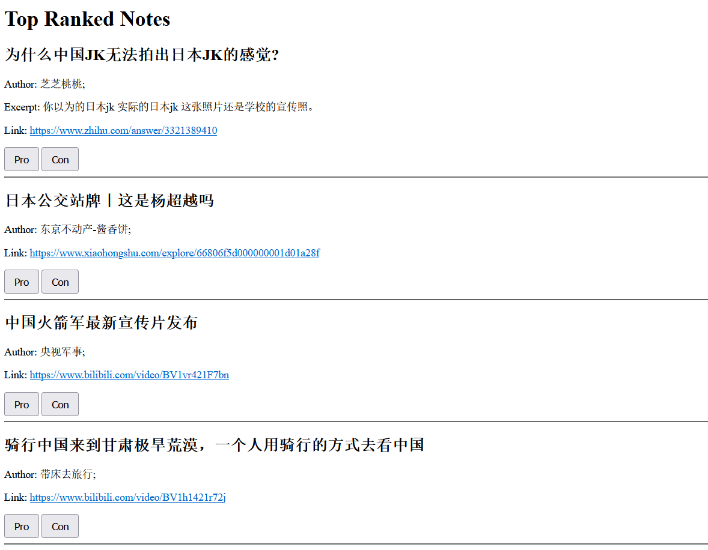

# NoteGate: Assembling Recommendation System

NoteGate is a web application that aggregates recommendation messages from multiple media platforms. It leverages [MediaCrawler](https://github.com/NanmiCoder/MediaCrawler), a crawler repository for streaming media implemented with [Playwright](https://playwright.dev/). NoteGate gathers and scores recommendations from the following platforms:

| Platform | 哔哩哔哩 (Bilibili) | 小红书 (Xiaohongshu) | 知乎 (Zhihu) | 快手 (Kuaishou) | 抖音 (Douyin) | 微博 (Weibo) |
| -------- | ------------------- | -------------------- | ------------ | --------------- | ------------- | ------------ |
|          | ✅                  | ✅                   | ✅           | ❌              | ❌            | ❌           |

## Download & Configure

1. Clone the repository:

   ```sh
   git clone --recursive https://github.com/FanryZ/NoteGate.git
   ```
2. Configure the environment for [MediaCrawler](https://github.com/NanmiCoder/MediaCrawler):

   ```sh
   pip install -r requirements.txt
   playwright install
   ```
3. Run NoteGate for the first time and save login messages in the browser cookie:

   ```sh
   python main.py --no-cookie
   ```
4. After configuring the cookie, run NoteGate:

   ```sh
   python main.py
   ```

With the context gathered from platforms, users can obtain filtered notes from `http://127.0.0.1:5000`. Adjust arguments as needed in `utils/config.py`.

## Preview

Visit the link to view notes. After viewing, provide your pros/cons using the buttons. The NoteGate backend will record your choices for note-ranking the next time.

Notes are scored and ranked using [Tf-idf Vectorizer](https://scikit-learn.org/stable/modules/generated/sklearn.feature_extraction.text.TfidfVectorizer.html) and [Naive Bayes Classifier](https://scikit-learn.org/stable/modules/generated/sklearn.naive_bayes.MultinomialNB.html). Tokenized notes labeled by users are saved in `database/notegate.db`.


